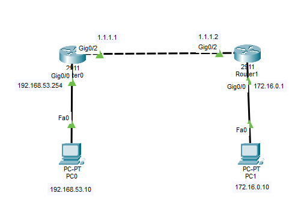
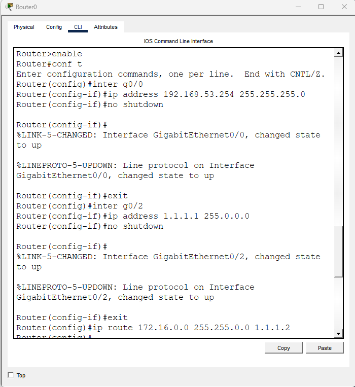
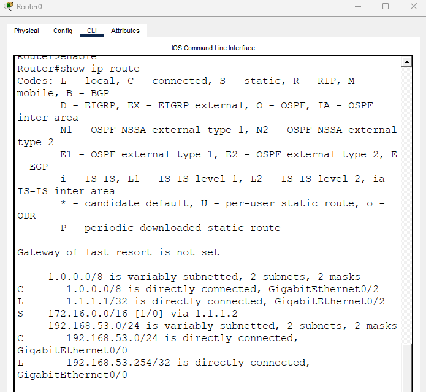
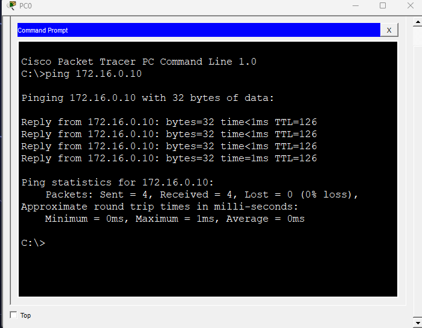

# Static Routing (정적 라우팅)

## Static Routing이란?

Static Routing(정적 라우팅)은 관리자가 직접 Router에 경로를 등록하는 방식이다.

Router는 기본적으로 자신에게 직접 연결된 네트워크만 알 수 있다.

따라서 다른 네트워크로 데이터를 보내기 위해서는

```text
"이 네트워크로 가려면 저 Router에게 보내라"
```

라는 경로 정보를 수동으로 등록해야 한다.

예를 들어,

```text
Router0 (1.1.1.1)
        │
        │
Router1 (1.1.1.2)
```

구조에서 Router0은 192.168.53.0/24 네트워크만 알고 있고, Router1은 172.16.0.0/16 네트워크만 알고 있다.

서로의 네트워크를 알기 위해 정적 라우팅을 추가해야 한다.

---

## 왜 Static Routing이 필요할까?

Router는 기본적으로 자신에게 설정된 인터페이스 네트워크와 직접 연결된 네트워크만 알고 있다.

예)

```text
PC A (192.168.53.10)

        ↓

Router0

        ↓

Router1

        ↓

PC B (172.16.0.10)
```

PC A가 PC B로 데이터를 보내면 Router0은

```text
172.16.0.0 네트워크를 어디로 보내야 하지?
```

를 알 수 없다.

따라서 목적지 네트워크의 경로를 직접 등록해야 한다.

---

## Static Route 명령어

```bash
ip route [목적지 네트워크] [서브넷마스크] [다음 홉]
```

형식

```bash
ip route Destination_Network Subnet_Mask Next_Hop
```

예)

```bash
ip route 172.16.0.0 255.255.0.0 1.1.1.2
```

의미

```text
172.16.0.0/16 네트워크로 가고 싶으면

1.1.1.2 Router에게 보내라
```

이다.

---

## Next Hop이란?

Next Hop은 목적지까지 가기 위해 다음으로 거쳐야 하는 Router의 IP 주소를 의미한다.

예)

```text
Router0 (1.1.1.1)
        │
        │
Router1 (1.1.1.2)
```

Router0 입장에서

```text
Next Hop = 1.1.1.2
```

이다.

※ 목적지 PC의 IP를 적는 것이 아니라 바로 옆 Router의 IP를 적는다.

---

## Static Routing 동작 과정

상황

```text
PC A (192.168.53.10)

        ↓

Router0

        ↓

Router1

        ↓

PC B (172.16.0.10)
```

Router0 설정

```bash
ip route 172.16.0.0 255.255.0.0 1.1.1.2
```

Router1 설정

```bash
ip route 192.168.53.0 255.255.255.0 1.1.1.1
```

통신 과정

```text
1. PC A가 PC B로 데이터 전송

2. Router0 수신

3. Routing Table 확인

4. 172.16.0.0/16 발견

5. Next Hop(1.1.1.2)으로 전송

6. Router1 수신

7. PC B 네트워크로 전달

8. PC B 수신
```

---

## 예제 토폴로지

패킷트레이서에서 아래와 같이 구성

```text
PC0
192.168.53.10

↓

Router0
G0/0 = 192.168.53.254
G0/1 = 1.1.1.1

↓

Router1
G0/0 = 1.1.1.2
G0/1 = 172.16.0.1

↓

PC1
172.16.0.10
```



---

## Router0 설정

인터페이스 설정

```bash
enable
configure terminal

interface g0/0
ip address 192.168.53.254 255.255.255.0
no shutdown

interface g0/1
ip address 1.1.1.1 255.0.0.0
no shutdown
```

정적 라우팅 설정

```bash
ip route 172.16.0.0 255.255.0.0 1.1.1.2
```



---

## Router1 설정

인터페이스 설정

```bash
enable
configure terminal

interface g0/0
ip address 1.1.1.2 255.0.0.0
no shutdown

interface g0/1
ip address 172.16.0.1 255.255.0.0
no shutdown
```

정적 라우팅 설정

```bash
ip route 192.168.53.0 255.255.255.0 1.1.1.1
```

---

## Routing Table 확인

명령어

```bash
show ip route
```

예)

```text
S 172.16.0.0/16 [1/0] via 1.1.1.2
```

의미

```text
S = Static Route

172.16.0.0/16 네트워크는

1.1.1.2로 전송
```

자주 보이는 코드

```text
C = Connected
S = Static
R = RIP
O = OSPF
D = EIGRP
```



---

## 통신 확인

명령어

```bash
ping 172.16.0.10
```

성공하면

```text
Reply from ...
```

메시지가 출력된다.



---

## 설정 확인

명령어

```bash
show running-config
```

현재 Router에 적용된 설정을 확인할 수 있다.

예)

```text
ip route 172.16.0.0 255.255.0.0 1.1.1.2
```

과 같은 Static Route 설정이 보인다.

---

## Static Routing의 장점

- 설정이 단순하다.
- 소규모 네트워크에 적합하다.
- Router 자원 사용량이 적다.
- 원하는 경로만 사용하도록 제어할 수 있다.

---

## Static Routing의 단점

- Router가 많아질수록 관리가 어려워진다.
- 경로를 모두 직접 입력해야 한다.
- 장애 발생 시 자동으로 다른 경로를 찾지 못한다.
- 관리자가 직접 수정해야 한다.

예)

```text
Router0

↓

Router1 (장애)

↓

Router2
```

Router1이 죽으면 통신도 함께 끊어진다.

---

## Static Routing vs Dynamic Routing

| 구분 | Static Routing | Dynamic Routing |
|--------|--------|--------|
| 설정 | 수동 | 자동 |
| 관리 | 어려움 | 쉬움 |
| 자원 사용 | 적음 | 많음 |
| 소규모 | 적합 | 가능 |
| 대규모 | 비효율 | 적합 |
| 장애 대응 | 수동 | 자동 |

---

## 암기 포인트

```text
Static Routing

관리자가 직접 경로 입력
```

```text
명령어

ip route
```

```text
형식

ip route 목적지네트워크 서브넷마스크 다음홉
```

```text
Next Hop

다음 Router의 IP
```

```text
확인 명령어

show ip route
```

---

## 정리

- Static Routing은 관리자가 직접 경로를 입력하는 방식이다.
- Router는 직접 연결된 네트워크만 알기 때문에 추가 경로를 등록해야 한다.
- ip route 명령어를 사용한다.
- Next Hop은 다음 Router의 IP 주소이다.
- 소규모 네트워크에서는 간단하고 효율적이다.
- 네트워크가 커질수록 관리가 어려워진다.

## 한 줄 요약

Static Routing은 Router에게 "이 네트워크는 저 Router로 보내라"라고 관리자가 직접 알려주는 라우팅 방식이다.
