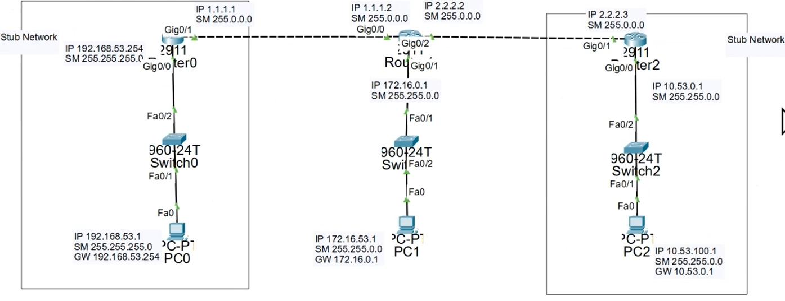
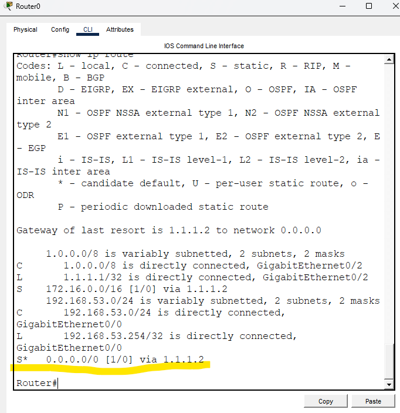
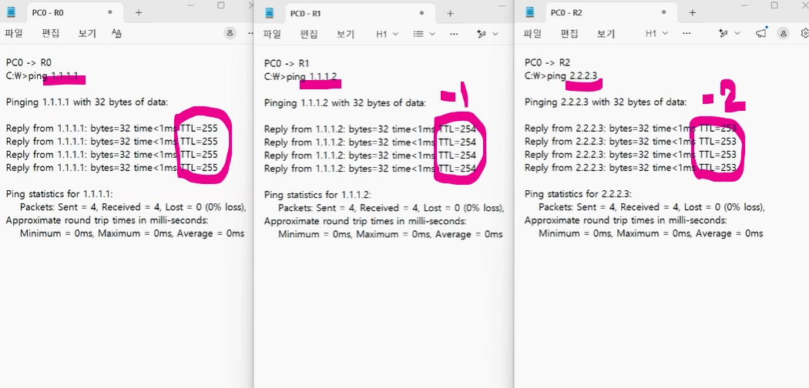

# Default Routing (기본 라우팅)

## Default Routing이란?

Default Routing(기본 라우팅)은 Router가 목적지 네트워크를 모를 때 사용하는 기본 경로이다.

Static Routing은 목적지마다 경로를 하나씩 등록해야 한다.

예)

```text
172.16.0.0/16 → Router1

192.168.10.0/24 → Router2

10.10.10.0/24 → Router3
```

하지만 실제 네트워크에는 수많은 네트워크가 존재한다.

이 모든 경로를 등록하는 것은 비효율적이다.

그래서 사용하는 것이

```text
Default Route
```

이다.

즉,

```text
모르는 네트워크는

일단 저 Router에게 보내라
```

라는 의미이다.

---

## Stub Network란?

Stub Network는

```text
출구가 하나뿐인 네트워크
```

이다.

예)

```text
PC들
  │
Router0
  │
Router1
  │
Internet
```

Router0 입장에서는

```text
외부로 나가는 길이

Router1 하나뿐
```

이다.

따라서

```text
모르는 네트워크

↓

전부 Router1로 전달
```

하면 된다.

그래서 Default Route는 보통 Stub Network에서 사용한다.


---

## Default Route 명령어

형식

```bash
ip route 0.0.0.0 0.0.0.0 NextHop
```

예)

```bash
ip route 0.0.0.0 0.0.0.0 1.1.1.2
```

의미

```text
모르는 모든 네트워크는

1.1.1.2 Router에게 보내라
```

---

## 왜 0.0.0.0/0을 사용할까?

```text
0.0.0.0/0

=

모든 네트워크
```

를 의미한다.

따라서

```bash
ip route 0.0.0.0 0.0.0.0 1.1.1.2
```

는

```text
모르는 모든 목적지는

1.1.1.2로 보내라
```

라는 뜻이다.

---

## Static Route와 Default Route 차이

Static Route

```bash
ip route 172.16.0.0 255.255.0.0 1.1.1.2
```

```text
172.16.0.0/16 네트워크만
1.1.1.2로 전송
```

---

Default Route

```bash
ip route 0.0.0.0 0.0.0.0 1.1.1.2
```

```text
모르는 모든 네트워크를
1.1.1.2로 전송
```

---

## Default Routing 동작 과정

상황

```text
PC

↓

Router0

↓

Router1

↓

Internet
```

Router0 설정

```bash
ip route 0.0.0.0 0.0.0.0 1.1.1.2
```

통신 과정

```text
1. PC가 8.8.8.8로 Ping 전송

2. Router0 수신

3. Routing Table 확인

4. 목적지 정보 없음

5. Default Route 발견

6. Router1(1.1.1.2)로 전달

7. Router1이 목적지 방향으로 전달
```

---

## Routing Table 확인

명령어

```bash
show ip route
```

예)

```text
S* 0.0.0.0/0 [1/0] via 1.1.1.2
```

의미

```text
S = Static
* = Default Route

0.0.0.0/0

↓

1.1.1.2로 전송
```



---

## TTL(Time To Live)

TTL은

```text
패킷이 Router를 통과할 수 있는 횟수
```

이다.

Router를 하나 지날 때마다 1 감소한다.

예)

```text
128

↓

127

↓

126
```

TTL이 0이 되면 패킷은 폐기된다.

대표 기본값

```text
Windows : 128

Linux : 64

Cisco : 255
```

---

## Default Route의 장점

### Routing Table이 단순해진다.

Static Route

```text
172.16.0.0

192.168.10.0

10.10.10.0

...
```

처럼 수많은 경로가 필요하다.

하지만

```text
0.0.0.0/0
```

하나로 처리할 수 있다.

### 관리가 쉽다.

경로를 일일이 추가하지 않아도 된다.

### 검색 속도가 빨라진다.

Routing Table이 단순해져 Router가 경로를 찾기 쉬워진다.

---

## 암기 포인트

```text
Default Route

=

모르는 네트워크의 기본 경로
```

```text
Stub Network에서 사용
```

```bash
ip route 0.0.0.0 0.0.0.0 NextHop
```

```text
0.0.0.0/0

=

모든 네트워크
```

```bash
show ip route
```

```text
S*

=

Default Route
```

---

## 정리

- Default Route는 모르는 네트워크를 위한 기본 경로이다.
- 주로 Stub Network에서 사용한다.
- `ip route 0.0.0.0 0.0.0.0 NextHop` 명령어를 사용한다.
- Routing Table을 단순하게 만들 수 있다.
- Router를 지날 때마다 TTL은 1씩 감소한다.
- `show ip route`에서 `S*`로 표시된다.

## 한 줄 요약

Default Route는 "모르는 목적지는 일단 저 Router로 보내라"라고 설정하는 기본 경로이다.
