# RIP (Routing Information Protocol)

## RIP란?

RIP(Routing Information Protocol)은 Distance Vector 방식의 동적 라우팅 프로토콜이다.

Router끼리 자신이 알고 있는 네트워크 정보를 주기적으로 교환하여 Routing Table을 자동으로 생성한다.

경로 선택 기준은 Hop Count이며, 목적지까지 거쳐야 하는 Router 수가 가장 적은 경로를 선택한다.

---

## RIP의 특징

- Distance Vector 방식
- Bellman-Ford 알고리즘 사용
- Hop Count 기준 경로 선택
- 최대 Hop Count = 15
- Hop Count 16 = 도달 불가
- 30초마다 Routing 정보 갱신
- 소규모 네트워크에 적합

---

## Hop Count란?

Hop Count는 목적지까지 거쳐야 하는 Router의 개수이다.

예)

```text
PC → R0 → R1 → Server
```

위 경로의 Hop Count는 2이다.

RIP는 여러 경로가 존재할 경우 Hop Count가 가장 작은 경로를 선택한다.

---

## RIP Timer

RIP는 주기적으로 Routing 정보를 갱신한다.

| Timer | 기본값 | 설명 |
|---------|---------|---------|
| Update | 30초 | Routing 정보 광고 |
| Invalid | 180초 | 업데이트 없으면 경로 의심 |
| Hold Down | 180초 | 경로 변경 억제 |
| Flush | 240초 | Routing Table 삭제 |

### Timer 동작 순서

```text
30초마다 광고(Update)

↓

180초 동안 광고 없음(Invalid)

↓

180초 동안 경로 사용 중지(Hold Down)

↓

240초 후 Routing Table 삭제(Flush)
```

---

## RIP Version

### RIPv1

- Classful Routing
- Subnet Mask 전달 안함
- VLSM 지원 불가

### RIPv2

- Classless Routing
- Subnet Mask 전달
- VLSM 지원 가능
- 현재 대부분 사용

---

## Auto Summary

RIPv2는 Subnet 정보를 자동으로 요약할 수 있다.

예)

```text
192.168.53.0/25

192.168.53.128/25
```

↓

```text
192.168.53.0/24
```

Subnetting 환경에서는 문제가 발생할 수 있으므로 일반적으로 비활성화한다.

```bash
no auto-summary
```

---

## RIP 설정

```bash
router rip
version 2
no auto-summary

network 192.168.53.0
network 1.0.0.0
```

### 명령어 설명

```bash
router rip
```

RIP 프로세스 시작

```bash
version 2
```

RIPv2 사용

```bash
no auto-summary
```

자동 요약 비활성화

```bash
network
```

광고할 네트워크 등록

---

## Routing Table 확인

```bash
show ip route
```

예)

```text
R 192.168.54.0/24 [120/1] via 1.1.1.2
```

의미

```text
R = RIP

120 = Administrative Distance

1 = Hop Count

via = Next Hop
```

---

## Split Horizon

Split Horizon은 Routing Loop를 방지하기 위한 기능이다.

Router가 어떤 인터페이스를 통해 받은 Routing 정보를 다시 같은 인터페이스로 광고하지 않는다.

예)

```text
R0 ←→ R1
```

R1은 R0에게서 받은 정보를 다시 R0에게 광고하지 않는다.

---

## 실습 1 - RIP 기본 설정

### 사용 장비

- Router 2대
- PC 2대
- Switch 2대

### 토폴로지

```text
PC0
192.168.53.10/24
GW 192.168.53.254

    |

Switch0

    |

R0 G0/0
192.168.53.254/24

R0 G0/1
1.1.1.1/8

    |

R1 G0/0
1.1.1.2/8

R1 G0/1
172.16.0.1/16

    |

Switch1

    |

PC1
172.16.0.10/16
GW 172.16.0.1
```

### 목표

- RIP 설정
- Router끼리 네트워크 학습
- PC0 ↔ PC1 Ping 성공

### 캡처

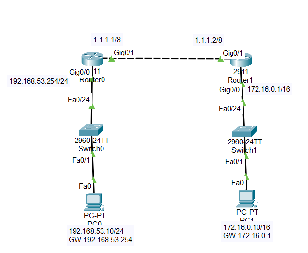

(토폴로지 전체 캡처)

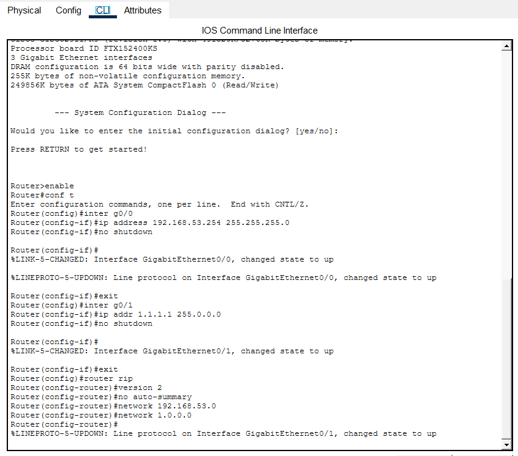

(R0의 RIP 설정 화면)

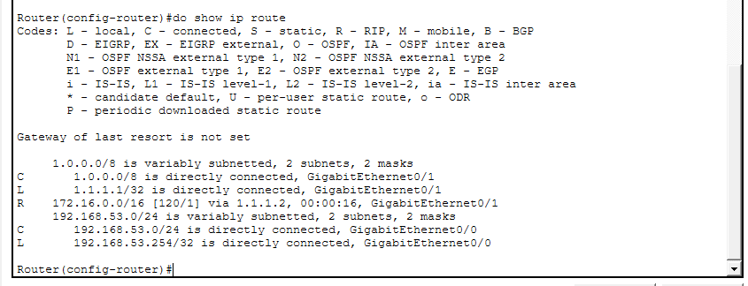

(show ip route 결과)

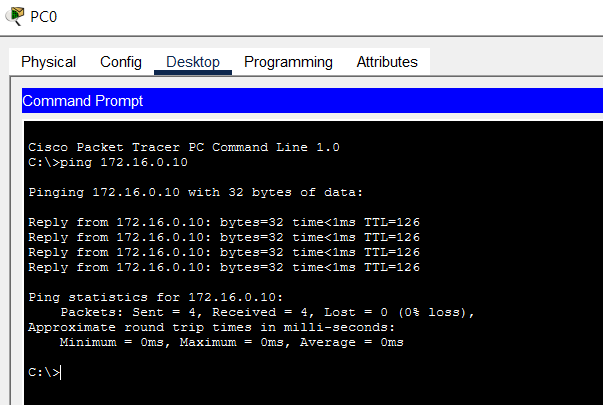

(PC0 → PC1 ping 성공)

---

## 실습 2 - RIPv2 + Subnetting

### 사용 장비

- Router 2대
- PC 3대
- Switch 3대

### 토폴로지

```text
PC0
192.168.53.10/25
GW 192.168.53.1

    |

Switch0

    |

R0 G0/0
192.168.53.1/25

R0 G0/1
192.168.53.129/25

    |

Switch1

    |

PC1
192.168.53.130/25
GW 192.168.53.129

R0 G0/2
1.1.1.1/8

    |

R1 G0/2
1.1.1.2/8

R1 G0/0
192.168.54.1/24

    |

Switch2

    |

PC2
192.168.54.10/24
GW 192.168.54.1
```

### 목표

- RIPv2 설정
- Auto Summary 동작 확인
- no auto-summary 차이 확인
- Subnetting 환경에서 RIP 동작 확인

### 캡처

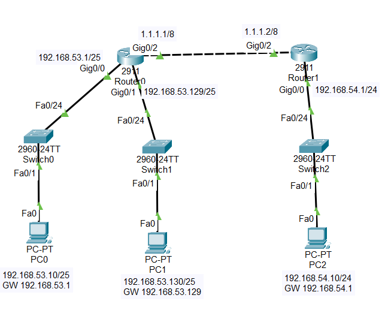

(토폴로지 전체 캡처)

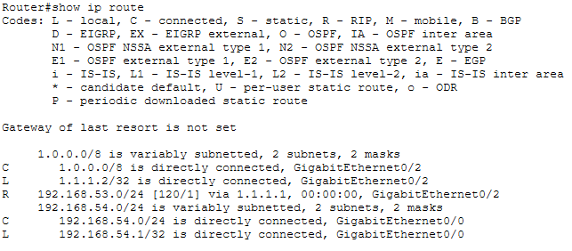

(auto-summary 활성화 상태의 show ip route 결과)

확인 내용

```text
R 192.168.53.0/24
```

로 요약되어 보이는지 확인

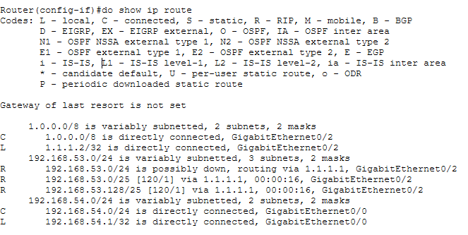

(no auto-summary 적용 후 show ip route 결과)

확인 내용

```text
R 192.168.53.0/25

R 192.168.53.128/25
```

두 네트워크가 각각 보이는지 확인

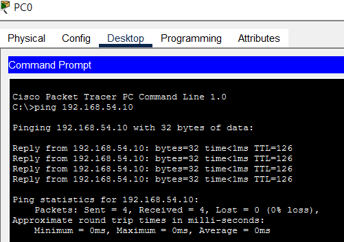

(PC0 → PC2 ping 성공)

## 실습 3 - Hop Count 확인

### 사용 장비

- Router 3대
- PC 2대
- Switch 2대

### 토폴로지

```text
PC0
192.168.53.10/24
GW 192.168.53.1

    |

Switch0

    |

R0 G0/0
192.168.53.1/24

R0 G0/1
10.10.10.1/24

    |

R1 G0/0
10.10.10.2/24

R1 G0/1
20.20.20.1/24

    |

R2 G0/0
20.20.20.2/24

R2 G0/1
192.168.55.1/24

    |

Switch1

    |

PC1
192.168.55.10/24
GW 192.168.55.1
```

### 목표

- RIP 학습 확인
- Hop Count 확인
- Routing Table 분석
- RIP 최단 경로 선택 확인

### 캡처

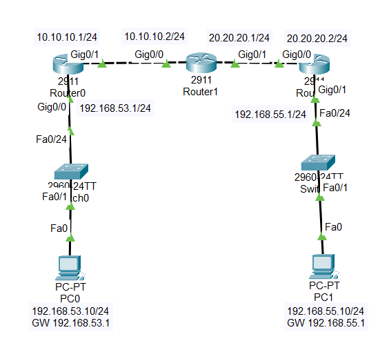

(토폴로지 전체 캡처)

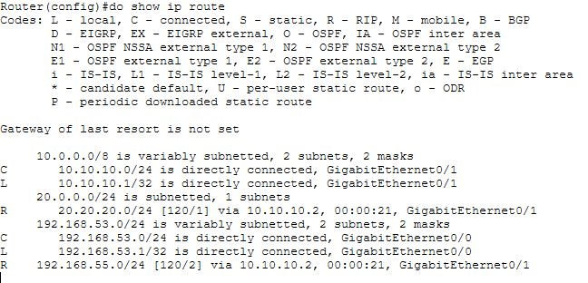

(show ip route 결과)

확인 내용

```text
R 192.168.55.0/24 [120/2]
```

```text
120 = Administrative Distance

2 = Hop Count
```

확인

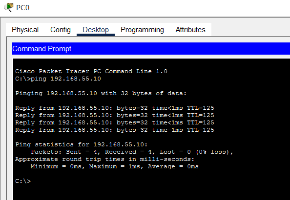

(PC0 → PC1 ping 성공)

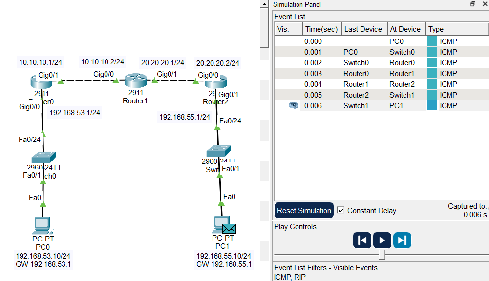

(Packet Tracer Simulation Mode)

확인 내용

```text
PC0

↓

R0

↓

R1

↓

R2

↓

PC1
```

순서로 패킷이 이동하는지 확인

---

## 암기 포인트

```text
Distance Vector

Bellman-Ford

Hop Count

최대 15 Hop

16 = Unreachable

30초 Update

RIPv2

no auto-summary

show ip route
```

---

## 정리

- RIP는 Distance Vector 기반의 동적 라우팅 프로토콜이다.
- Router끼리 Routing 정보를 주기적으로 교환한다.
- Hop Count가 가장 작은 경로를 선택한다.
- 최대 Hop Count는 15이다.
- RIPv2는 VLSM을 지원한다.
- Subnetting 환경에서는 no auto-summary를 사용하는 것이 일반적이다.
- show ip route 명령어로 학습된 경로를 확인할 수 있다.

## 한 줄 요약

RIP는 Router끼리 경로 정보를 주고받으며 Hop Count를 기준으로 최단 경로를 선택하는 동적 라우팅 프로토콜이다.
