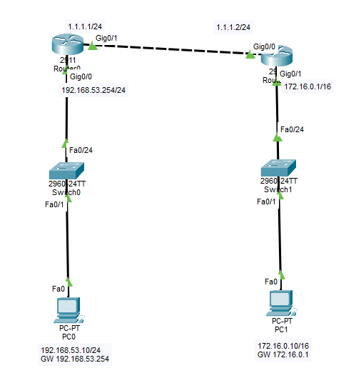
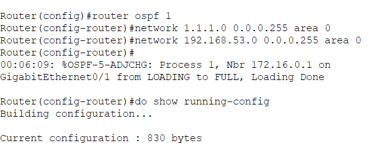
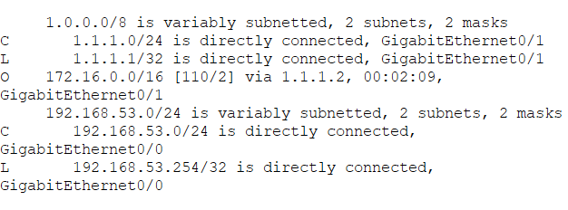
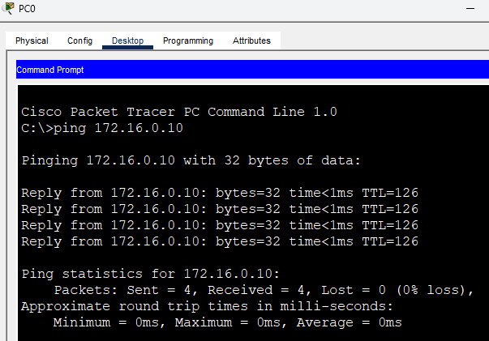

# OSPF (Open Shortest Path First)

## OSPF란?

OSPF(Open Shortest Path First)는 Link State 방식의 동적 라우팅 프로토콜이다.

Router끼리 자신의 연결 상태(Link State)를 서로 교환하여 전체 네트워크 구조를 학습한 뒤 최적의 경로를 계산한다.

RIP가

```text
Hop Count(라우터 개수)
```

를 기준으로 경로를 선택한다면,

OSPF는

```text
Cost(대역폭)
```

를 기준으로 경로를 선택한다.

즉,

```text
가장 가까운 길
```

이 아니라

```text
가장 빠른 길
```

을 선택하는 프로토콜이다.

기업 환경에서는 RIP보다 OSPF를 훨씬 많이 사용한다.

---

## 왜 OSPF를 사용할까?

RIP는 설정이 쉽지만 한계가 있다.

```text
최대 Hop Count = 15

30초마다 전체 갱신

대규모 네트워크 비효율
```

반면 OSPF는

```text
네트워크 변화 시 즉시 갱신

빠른 수렴

대규모 네트워크 지원
```

이 가능하다.

그래서 실제 기업 네트워크에서는 OSPF가 대표적으로 사용된다.

---

## OSPF 핵심 개념

OSPF는 Link State 방식으로 동작하며 Dijkstra(다익스트라) 알고리즘을 사용한다.

Router들은 서로 링크 상태 정보를 교환하고,

각 Router는 전체 네트워크 지도를 만든 뒤 최적의 경로를 계산한다.

---

OSPF는 RIP처럼 Hop Count를 사용하지 않고

```text
Cost
```

를 사용한다.

Cost는 회선 속도(대역폭)를 기준으로 계산된다.

공식

```text
Cost = 100,000,000 ÷ Bandwidth(bps)
```

예)

```text
100Mbps

↓

Cost = 1
```

```text
10Mbps

↓

Cost = 10
```

즉

```text
Cost가 낮을수록

더 빠른 경로
```

이다.

그래서 OSPF는 Router를 조금 더 거치더라도 대역폭이 높은 경로를 선택할 수 있다.

---

OSPF는 대규모 네트워크 관리를 위해

```text
Area
```

개념을 사용한다.

가장 중요한 Area는

```text
Area 0
```

이며

```text
Backbone Area
```

라고 부른다.

모든 OSPF Area는 결국 Area 0과 연결되어야 한다.

비유하면

```text
Area 0

=

고속도로 본선
```

```text
Area 1, 2, 3

=

지역 도로
```

라고 생각하면 된다.

---

AS(Autonomous System)는

```text
같은 라우팅 정책을 사용하는

하나의 네트워크 그룹
```

이다.

쉽게 말하면

```text
한 회사의 네트워크
```

정도로 이해하면 된다.

---

ASBR(Autonomous System Boundary Router)은

내부 네트워크와 외부 네트워크를 연결하는 Router이다.

예)

```text
OSPF 네트워크

↓

ASBR

↓

인터넷
```

즉 네트워크의 경계 역할을 수행한다.

---

## Wildcard Mask란?

OSPF는 RIP와 달리

```text
Subnet Mask
```

를 직접 사용하지 않고

```text
Wildcard Mask
```

를 사용한다.

Wildcard Mask는

```text
Subnet Mask를 뒤집은 값
```

이다.

공식

```text
255 - Subnet Mask
```

---

예)

```text
255.255.255.0

↓

0.0.0.255
```

```text
255.255.255.128

↓

0.0.0.127
```

```text
255.255.255.192

↓

0.0.0.63
```

```text
255.255.255.224

↓

0.0.0.31
```

```text
255.255.255.240

↓

0.0.0.15
```

---

Wildcard Mask의 의미

```text
0

=

반드시 일치
```

```text
1

=

상관 없음
```

(실제로는 비트 단위로 동작)

예)

```bash
network 192.168.53.0 0.0.0.255 area 0
```

의 의미는

```text
192.168.53.x

대역 전체를

OSPF에 등록
```

하라는 뜻이다.

---

## OSPF 설정

OSPF 활성화

```bash
router ospf 1
```

여기서

```text
1
```

은 Process ID이다.

Process ID는 Router 내부에서만 사용하는 번호이며 다른 Router와 같을 필요는 없다.

---

네트워크 등록

```bash
network 192.168.53.0 0.0.0.255 area 0

network 1.1.1.0 0.0.0.255 area 0
```

의 의미

```text
192.168.53.0/24

↓

Area 0 등록
```

```text
1.1.1.0/24

↓

Area 0 등록
```

---

OSPF 기본 설정 예시

```bash
router ospf 1

network 192.168.53.0 0.0.0.255 area 0

network 1.1.1.0 0.0.0.255 area 0
```

---

## Routing Table 확인

OSPF가 정상적으로 동작하면

```bash
show ip route
```

명령어로 확인할 수 있다.

예)

```text
O 172.16.0.0/16 [110/2] via 1.1.1.2
```

의 의미

```text
O

↓

OSPF로 학습한 경로
```

```text
110

↓

Administrative Distance
(OSPF 기본값)
```

```text
2

↓

Cost
```

```text
via 1.1.1.2

↓

Next Hop
```

즉

```text
172.16.0.0/16 네트워크는

OSPF를 통해 학습했고

1.1.1.2 Router를 통해 이동하며

Cost는 2
```

라는 의미이다.

---

## 실습 1 - OSPF Single Area

### 사용 장비

- Router 2대
- PC 2대
- Switch 2대

### 토폴로지

```text
PC0
192.168.53.10/24
GW 192.168.53.254

    |

Switch0

    |

R0 G0/0
192.168.53.254/24

R0 G0/1
1.1.1.1/24

    |

R1 G0/0
1.1.1.2/24

R1 G0/1
172.16.0.1/16

    |

Switch1

    |

PC1
172.16.0.10/16
GW 172.16.0.1
```

### 목표

- OSPF 설정
- Area 0 사용
- Wildcard Mask 적용
- Router끼리 OSPF Neighbor 형성
- PC0 ↔ PC1 Ping 성공

### 캡처



(토폴로지 전체 캡처)



(R0 OSPF 설정 화면)



(show ip route 결과)

확인 내용

```text
O 172.16.0.0/16
```

처럼

```text
O
```

코드가 보이는지 확인



(PC0 → PC1 Ping 성공)

---

## RIP와 OSPF 비교

| 구분 | RIP | OSPF |
|--------|--------|--------|
| 방식 | Distance Vector | Link State |
| 기준 | Hop Count | Cost |
| 알고리즘 | Bellman-Ford | Dijkstra |
| 최대 Hop | 15 | 제한 없음 |
| 갱신 방식 | 30초 주기 | 변화 시 즉시 |
| 속도 | 느림 | 빠름 |
| 규모 | 소규모 | 대규모 |
| 실제 사용 | 거의 없음 | 매우 많음 |

---

## 암기 포인트

```text
OSPF

Open Shortest Path First
```

```text
Link State
```

```text
Dijkstra Algorithm
```

```text
Cost 기반 경로 선택
```

```text
Area 0

Backbone Area
```

```text
Wildcard Mask

255 - Subnet Mask
```

```text
router ospf 1
```

```text
network x.x.x.x wildcard area 0
```

```text
show ip route

코드 O
```

---

## 정리

- OSPF는 Link State 기반의 동적 라우팅 프로토콜이다.
- Router끼리 링크 상태 정보를 교환하여 전체 네트워크 구조를 학습한다.
- RIP처럼 Hop Count가 아니라 Cost(대역폭)를 기준으로 경로를 선택한다.
- Dijkstra 알고리즘을 사용한다.
- 대규모 네트워크를 위해 Area 개념을 사용한다.
- 모든 Area는 Area 0과 연결되어야 한다.
- 설정 시 Wildcard Mask를 사용한다.
- show ip route에서 O 코드로 확인할 수 있다.

## 한 줄 요약

OSPF는 Router들이 네트워크 전체 구조를 학습한 뒤 Cost(대역폭)를 기준으로 가장 빠른 경로를 선택하는 대표적인 Link State 동적 라우팅 프로토콜이다.
