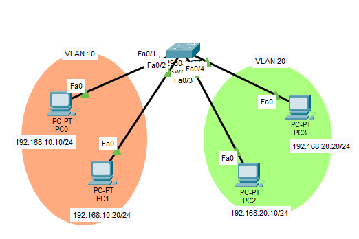
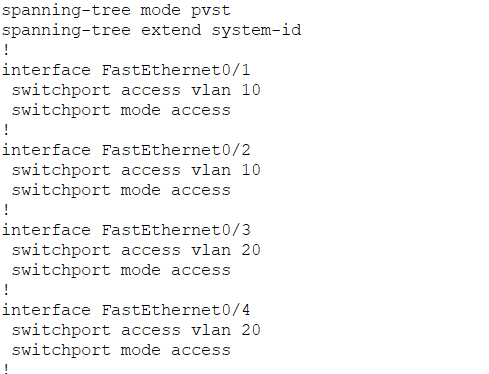
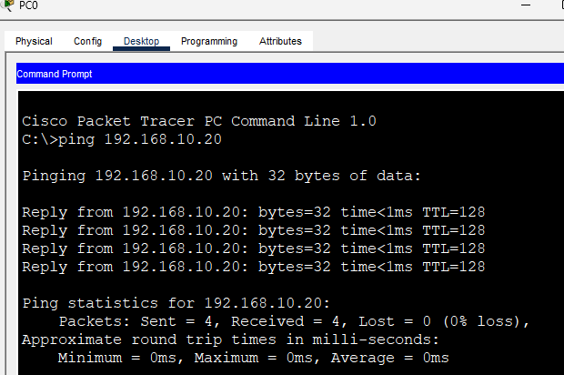
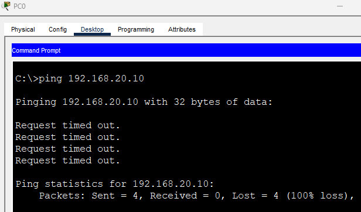

# VLAN (Virtual Local Area Network)

## VLAN이란?

VLAN(Virtual Local Area Network)은 하나의 물리적인 네트워크를 여러 개의 논리적인 네트워크로 분리하는 기술이다.

원래 Switch는 연결된 모든 장비를 하나의 LAN으로 인식한다.

예를 들어 PC가 100대 연결되어 있다면 Broadcast도 100대 모두에게 전달된다.

장비 수가 많아질수록 불필요한 Broadcast Traffic이 증가하여 네트워크 성능이 저하될 수 있다.

VLAN은 하나의 Switch를 여러 개의 가상 Switch처럼 동작하게 만들어 네트워크를 분리한다.

예)

```text
VLAN10
PC1
PC2

VLAN20
PC3
PC4
```

물리적으로는 같은 Switch에 연결되어 있지만 서로 다른 LAN처럼 동작한다.

---

## VLAN을 왜 사용할까?

### Broadcast Traffic 감소

하나의 LAN을 여러 개로 나누어 Broadcast 범위를 줄일 수 있다.

```text
기존

PC 100대

↓

Broadcast 100대 전달
```

```text
VLAN 적용

VLAN10 = 50대

VLAN20 = 50대

↓

각 VLAN 내부에서만 Broadcast
```

---

### 보안 향상

부서별 또는 용도별로 네트워크를 분리할 수 있다.

예)

```text
VLAN10 = 인사팀

VLAN20 = 개발팀

VLAN30 = 서버실
```

VLAN이 다르면 기본적으로 직접 통신할 수 없으므로 접근을 제한하기 쉬워진다.

실제 회사에서는 VLAN으로 분리한 뒤 ACL 또는 Firewall 정책을 추가하여 필요한 통신만 허용한다.

---

### 관리 편의성

물리적으로 케이블을 다시 연결하지 않아도 논리적으로 네트워크를 분리할 수 있다.

---

## VLAN을 쉽게 이해하기

하나의 사무실을 생각해보자.

원래는

```text
직원 100명

↓

하나의 큰 방
```

이다.

누군가 큰 소리로 말하면 모든 사람이 듣는다.

(Broadcast)

하지만 부서를 나누면

```text
인사팀 방

개발팀 방

회계팀 방
```

처럼 분리된다.

이것이 VLAN이다.

물리적으로는 같은 회사 건물이지만 논리적으로는 서로 다른 공간처럼 동작한다.

---

## VLAN 동작 원리

Switch는 VLAN ID를 이용하여 장비를 구분한다.

예)

```text
Fa0/1 → VLAN10

Fa0/2 → VLAN10

Fa0/3 → VLAN20

Fa0/4 → VLAN20
```

그러면

```text
Fa0/1 ↔ Fa0/2 통신 가능

Fa0/3 ↔ Fa0/4 통신 가능

VLAN10 ↔ VLAN20 통신 불가
```

가 된다.

---

## VLAN과 Subnetting 차이

많은 사람들이 VLAN과 Subnetting을 헷갈린다.

하지만 완전히 다른 개념이다.

### VLAN

```text
Layer 2

Switch 기술

네트워크 구역 분리
```

예)

```text
VLAN10

VLAN20
```

---

### Subnetting

```text
Layer 3

IP 기술

IP 주소 대역 분리
```

예)

```text
192.168.1.0/24

↓

192.168.1.0/25

192.168.1.128/25
```

---

정리

```text
VLAN

↓

LAN 분리
```

```text
Subnetting

↓

IP 대역 분리
```

실무에서는 보통 VLAN 하나당 하나의 Subnet을 사용한다.

예)

```text
VLAN10 → 192.168.10.0/24

VLAN20 → 192.168.20.0/24

VLAN30 → 192.168.30.0/24
```

---

## 회사에서는 VLAN끼리 어떻게 통신할까?

회사에서는 인터넷도 사용해야 하고 서버도 접근해야 한다.

따라서 Router 또는 L3 Switch가 반드시 존재한다.

예)

```text
PC

↓

Switch

↓

Router 또는 L3 Switch

↓

Internet
```

인터넷으로 나갈 수 있다는 것은 Router가 존재한다는 뜻이고,

Router는 VLAN 간 이동도 가능하게 해준다.

예)

```text
VLAN10

↓

Router

↓

VLAN20
```

이것을

```text
Inter-VLAN Routing
```

이라고 한다.

즉,

```text
VLAN은 분리

Router는 연결
```

을 담당한다.

---

## Access Mode

Access Mode는 하나의 VLAN만 통과할 수 있는 Port Mode이다.

주로 PC, Printer, Server 같은 End Device가 연결된다.

```text
PC

↓

Access Port

↓

Switch
```

특징

```text
하나의 VLAN만 사용

PC와 연결

VLAN Tag 제거 상태로 통신
```

기본 설정 예시

```bash
Switch(config)# vlan 10

Switch(config)# interface fa0/1

Switch(config-if)# switchport mode access

Switch(config-if)# switchport access vlan 10
```

---

## Trunk Mode

Trunk Mode는 여러 VLAN을 동시에 전달할 수 있는 Port Mode이다.

주로

```text
Switch ↔ Switch

Switch ↔ Router

Switch ↔ L3 Switch
```

연결에 사용한다.

특징

```text
여러 VLAN 전달 가능

VLAN Tag 유지

Switch 간 연결
```

설정 예시

```bash
Switch(config)# interface fa0/24

Switch(config-if)# switchport mode trunk
```

특정 VLAN만 허용

```bash
Switch(config-if)# switchport trunk allowed vlan 10,20
```

위 설정이면 VLAN10, VLAN20만 통과 가능하다.

---

## Dynamic Port Mode (DTP)

DTP(Dynamic Trunking Protocol)는 Cisco 장비가 Port Mode를 자동으로 협상하는 기능이다.

Mode 종류

```text
Access
→ DTP 사용 안 함

Trunk
→ 강제로 Trunk

Dynamic Auto
→ 상대가 Trunk 원하면 Trunk

Dynamic Desirable
→ 먼저 Trunk 요청
```

실무에서는 대부분 Access 또는 Trunk를 명시적으로 설정한다.

---

## VLAN Tagging Protocol

Trunk Port를 통해 여러 VLAN을 전달하려면 VLAN 정보를 Frame에 기록해야 한다.

이것을 VLAN Tagging이라고 한다.

### IEEE 802.1Q (Dot1Q)

현재 가장 많이 사용하는 표준 방식

```text
Ethernet Frame

+

VLAN ID
```

를 추가하여 전송한다.

---

### ISL (Inter-Switch Link)

Cisco 전용 방식이다.

현재는 거의 사용하지 않으며 대부분 Dot1Q를 사용한다.

---

## VTP (VLAN Trunk Protocol)

Cisco 전용 프로토콜이다.

Switch끼리 VLAN 정보를 자동으로 공유한다.

### Server Mode

```text
VLAN 생성 가능

VLAN 수정 가능

VLAN 삭제 가능

정보 전송
```

### Client Mode

```text
VLAN 생성 불가

VLAN 수정 불가

VLAN 삭제 불가

정보 수신
```

### Transparent Mode

```text
VLAN 생성 가능

VLAN 수정 가능

VLAN 삭제 가능

자신의 VLAN 정보는 전송 안 함

받은 정보는 전달
```

---
## 실습 - VLAN 분리 (Access Mode)
### 사용 장비
- Switch 1대
- PC 4대

### 토폴로지
```text
PC0 -------- Fa0/1

PC1 -------- Fa0/2

                SW0

PC2 -------- Fa0/3

PC3 -------- Fa0/4
```
### IP 설정
```text
VLAN10

PC0
192.168.10.10/24

PC1
192.168.10.20/24


VLAN20

PC2
192.168.20.10/24

PC3
192.168.20.20/24
```

###목표
- VLAN10 생성
- VLAN20 생성
- Access Port 설정
- 같은 VLAN끼리 통신 확인
- 다른 VLAN끼리 통신 불가 확인



(토폴로지 전체)



(VLAN 생성 및 Access 설정)



(PC0 → PC1 Ping 성공)



(PC0 → PC2 Ping 실패)

---

## 정리

- VLAN은 하나의 물리 네트워크를 여러 개의 논리 네트워크로 분리하는 기술이다.
- Broadcast 범위를 줄여 네트워크 성능을 향상시킨다.
- Access Port는 하나의 VLAN만 전달한다.
- Trunk Port는 여러 VLAN을 동시에 전달한다.
- VLAN끼리는 기본적으로 통신할 수 없다.
- VLAN 간 통신을 위해서는 Inter-VLAN Routing이 필요하다.
- 실무에서는 VLAN 하나당 하나의 Subnet을 사용하는 경우가 많다.
- 실제 통신 허용 여부는 Router, L3 Switch, ACL, Firewall이 결정한다.

## 한 줄 요약

VLAN은 하나의 물리적인 Switch를 여러 개의 논리적인 LAN으로 분리하여 Broadcast를 줄이고 보안을 높이는 대표적인 Layer 2 기술이며, VLAN 간 통신은 Inter-VLAN Routing을 통해 이루어진다.
